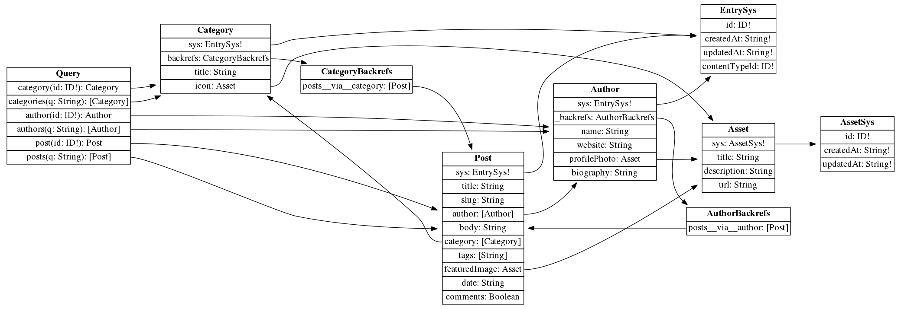

# cf-graphql

[](https://travis-ci.org/contentful-labs/cf-graphql)
[](https://www.npmjs.com/package/cf-graphql)
[](https://www.npmjs.com/package/cf-graphql)
[](https://david-dm.org/contentful-labs/cf-graphql)
[](https://david-dm.org/contentful-labs/cf-graphql?type=dev)
[](https://codecov.io/gh/contentful-labs/cf-graphql)

`cf-graphql` is a library that allows you to query your data stored in [Contentful](https://www.contentful.com/) with [GraphQL](http://graphql.org/). A schema and value resolvers are automatically generated out of an existing space.

Generated artifacts can be used with any node-based GraphQL server. The outcome of the project's main function call is an instance of the [`GraphQLSchema`](http://graphql.org/graphql-js/type/#graphqlschema) class.


## Table of contents

- [Disclaimers](#disclaimers)
- [First steps](#first-steps)
- [Demo](#demo)
  - [Run it locally](#run-it-locally)
  - [Deploy to Zeit's now](#deploy-to-zeits-now)
- [Programmatic usage](#programmatic-usage)
- [Querying](#querying)
- [Helpers](#helpers)
- [Contributing](#contributing)


## Disclaimers

Please note that `cf-graphql` library is released as an experiment:

- we might introduce breaking changes into programmatic interfaces and space querying approach before v1.0 is released
- there’s no magic bullet: complex GraphQL queries can result in a large number of CDA calls, which will be counted against your quota
- we might discontinue development of the library and stop maintaining it


## First steps

If you just want to see how it works, please follow the [Demo](#demo) section. You can deploy the demo with your own credentials so it queries your own data.

In general `cf-graphql` is a library and it can be used as a part of your project. If you want to get your hands dirty coding, follow the [Programmatic usage](#programmatic-usage) section.


## Demo

We host an [online demo](https://cf-graphql-demo.now.sh/) for you. You can query Contentful's "Blog" space template there. This how its graph looks like:




### Run it locally

This repository contains a demo project. The demo comes with a web server (with [CORS](https://developer.mozilla.org/en-US/docs/Web/HTTP/Access_control_CORS) enabled) providing the GraphQL, [an in-browser IDE (GraphiQL)](https://github.com/graphql/graphiql) and a React Frontend application using this endpoint.

To run it, clone the repository, install dependencies and start a server:

```
git clone git@github.com:contentful-labs/cf-graphql.git
cd cf-graphql/demo
# optionally change your node version with nvm, anything 6+ should work just fine
# we prefer node v6 matching the current AWS Lambda environment
nvm use
npm install
npm start
```

Use <http://localhost:4000/graphql/> to query the data from within your application and navigate to <http://localhost:4000> to use the IDE (GraphiQL) for test-querying. Please refer to the [Querying](#querying) section for more details.

If you also want to see how to integrate GraphQL in a React technology stack the demo project also contains an application based on the [Apollo framework](https://www.apollodata.com/). To check it out use <http://localhost:4000/client/>.

To use your own Contentful space with the demo, you have to provide:

- space ID
- CDA token
- CMA token

Please refer the ["Authentication" section](https://www.contentful.com/developers/docs/references/authentication/) of Contentful's documentation.

You can provide listed values with env variables:

```
SPACE_ID=some-space-id CDA_TOKEN=its-cda-token CMA_TOKEN=your-cma-token npm start
```


### Deploy to [Zeit's `now`](https://zeit.co/now)

To be able to deploy to [Zeit's `now`](https://zeit.co/now) you need to have an activated account. There is a free open source option available.

You can also deploy the demo with `now`. In your terminal, navigate to the `demo/` directory and run:

```
npm run deploy-demo-now
```

As soon as the deployment is done you'll have a URL of your GraphQL server copied.

You can also create a deployment for your own space:

```
SPACE_ID=some-space-id CDA_TOKEN=its-cda-token CMA_TOKEN=your-cma-token npm run deploy-now
```

Please note:

- when deploying a server to consume Contentful's "Blog" space template, the command to use is `npm run deploy-demo-now`; when the demo should be configured to use your own space, the command is `npm run deploy-now`
- if you've never used `now` before, you'll be asked to provide your e-mail; just follow on-screen instructions
- if you use `now`'s OSS plan (the default one), the source code will be public; it's completely fine: all credentials are passed as env variables and are not available publicly


## Programmatic usage

The library can be installed with `npm`:

```
npm install --save cf-graphql
```

Let's assume we've required this module with `const cfGraphql = require('cf-graphql')`. To create a schema out of your space you need to call `cfGraphgl.createSchema(spaceGraph)`.

What is `spaceGraph`? It is a graph-like data structure containing descriptions of content types of your space which additionally provide some extra pieces of information allowing the library to create a GraphQL schema.

To prepare this data structure you need to fetch raw content types data from the [CMA](https://www.contentful.com/developers/docs/references/content-management-api/). Let's create a Contentful client first:

```js
const client = cfGraphql.createClient({
  spaceId: 'some-space-id',
  cdaToken: 'its-cda-token',
  cmaToken: 'your-cma-token'
});
```

`spaceId`, `cdaToken` and `cmaToken` options are required. You can also pass the following options:

- `locale` - a locale code to use when fetching content. If not provided, the default locale of a space is used
- `preview` - if `true`, CPA will be used instead of CDA for fetching content
- `cpaToken` - if `preview` is `true` then this option has to hold a CPA token

Fetch content types with your `client` and then pass them to `cfGraphql.prepareSpaceGraph(rawCts)`:

```js
client.getContentTypes()
.then(cfGraphql.prepareSpaceGraph)
.then(spaceGraph => {
  // `spaceGraph` can be passed to `cfGraphql.createSchema`!
});
```

The last step is to use the schema with a server. A popular choice is [express-graphql](https://github.com/graphql/express-graphql). The only caveat is how the context is constructed. The library expects the `entryLoader` key of the context to be set to an instance created with `client.createEntryLoader()`:

```js
// Skipped in snippet: `require` calls, Express app setup, `client` creation.
// `spaceGraph` was fetched and prepared in the previous snippet. In most cases
// you shouldn't be doing it per request, once is fine.
const schema = cfGraphql.createSchema(spaceGraph);

// IMPORTANT: we're passing a function to `graphqlHTTP`: this function will be
// called every time a GraphQL query arrives to create a fresh entry loader.
// You can also use `expressGraphqlExtension` described below.
app.use('/graphql', graphqlHTTP(function () {
  return {
    schema,
    context: {entryLoader: client.createEntryLoader()}
  };
}));
```

[You can see a fully-fledged example in the `demo/` directory](./demo/server.js).


## Querying

For each Contentful content type three root-level fields are created:

- a singular field accepts a required `id` argument and resolves to a single entity
- a collection field accepts an optional `q`, `skip` and `limit` arguments and resolves to a list of entities
- a collection metadata field accepts an optional `q` argument and resolves to a metadata object (currently comprising only `count`)


Please note that:

- the `q` argument is a query string you could use with the [CDA](https://www.contentful.com/developers/docs/references/content-delivery-api/)
- both `skip` and `limit` arguments can be used to fetch desired page of results
  * `skip` defaults to `0`
  * `limit` defaults to `50` and cannot be greater than `1000`
* some query string parameters cannot be used:
  * `skip`, `limit` - use collection field arguments instead
  * `include`, `content_type` - no need for them, the library will determine and use appropriate values internally
  * `locale` - all the content is fetched for a single locale. By default the default locale is used; alternate locale can be selected with the `locale` configuration option of `cfGraphql.createClient`

Assuming you've got two content types named `post` and `author` with listed fields, this query is valid:

```graphql
{
  authors {
    name
  }

  authors(skip: 10, limit: 10) {
    title
    rating
  }

  _authorsMeta {
    count
  }

  posts(q: "fields.rating[gt]=5") {
    title
    rating
  }

  _postsMeta(q: "fields.rating[gt]=5") {
    count
  }

  post(id: "some-post-id") {
    title
    author
    comments
  }
}
```

Reference fields will be resolved to:

- a specific type, if there is a validation that allows only entries of some specific content type to be linked
- the `EntryType`, if there is no such constraint. The `EntryType` is an interface implemented by all the specific types

Example where the `author` field links only entries of one content type and the `related` field links entries of multiple content types:

```graphql
{
  posts {
    author {
      name
      website
    }

    related {
      ... on Tag {
        tagName
      }
      ... on Place {
        location
        name
      }
    }
  }
}
```

Backreferences (_backrefs_) are automatically created for links. Assume our `post` content type links to the `author` content type via a field named `author`. Getting an author of a post is easy, getting a list of posts by an author is not. `_backrefs` mitigate this problem:

```graphql
{
  authors {
    _backrefs {
      posts__via__author {
        title
      }
    }
  }
}
```

When using backreferences, there is a couple of things to keep in mind:

- backrefs may be slow; always test with a dataset which is comparable with what you've got in production
- backrefs are generated only when a reference field specifies a single allowed link content type
- `_backrefs` is prefixed with a single underscore
- `__via__` is surrounded with two underscores; you can read this query out loud like this: _"get posts that link to author via the author field"_


## Helpers

`cf-graphql` comes with helpers that help you with the `cf-graphql` integration. These are used inside of [the demo application](https://github.com/contentful-labs/cf-graphql/tree/master/demo).


### `expressGraphqlExtension`

`expressGraphqlExtension` is a simple utility producing a function that can be passed directly to the [`express-graphql` middleware](https://github.com/graphql/express-graphql).

```javascript
// Skipped in this snippet: client and space graph creation
const schema = cfGraphql.createSchema(spaceGraph);

const opts = {
  // display the current cf-graphql version in responses
  version: true,
  // include list of the underlying Contentful CDA calls with their timing
  timeline: true,
  // display detailed error information
  detailedErrors: true
};

const ext = cfGraphql.helpers.expressGraphqlExtension(client, schema, opts);
app.use('/graphql', graphqlHTTP(ext));
```

**Important**: Most likely don't want to enable `timeline` and `detailedErrors` in your production environment.


### `graphiql`

If you want to run your own GraphiQL and don't want to rely on the one shipping with e.g. [express-graphql](https://github.com/graphql/express-graphql) then you could use the `graphiql` helper.

```javascript
const ui = cfGraphql.helpers.graphiql({title: 'cf-graphql demo'});
app.get('/', (_, res) => res.set(ui.headers).status(ui.statusCode).end(ui.body));
```


## Contributing

Issue reports and PRs are more than welcomed.


## License

MIT
